# Deformation QA

## 1. Setup

- Body: default parameters, MakeHuman hm08 with the CC0 `weights.default.json` (top 4 bones per vertex).
- Pose set (`packages/human/src/makehuman/qa-poses.ts`, all inside the joint limits): arms up (abduction
  125 degrees from the A-pose), elbows at 140 degrees, deep squat (hips -105, knees 135, ankles -30, root
  -0.42 m), fists, head turned 90 degrees (three neck bones + head), jaw open 25 degrees.
- Metric (`deformation-metrics.ts`) over 26,756 triangles: **collapsed** = area below 20 % of rest;
  **inverted** = normal pointing against the rest normal carried by the triangle's dominant bone.
  Inverted counts include natural skin folds (inner elbow, palm, back of knee), so they overstate damage.
- Images: `apps/web/scripts/capture-deformation.mjs <label>` from `/lab/human` (QA pose picker).
- Regression guard: `deformation-qa.test.ts` fails if any pose gets worse than its baseline. Since plan
  2.8 the guard uses the dense body (section 2a); the table below is the coarse 2026-10-05 baseline.

## 2. Linear blend skinning (kept)

| Pose | Collapsed | Inverted | Worst area | Main regions |
|---|---|---|---|---|
| Arms up | 26 | 118 | 0.06 | upper arm / armpit |
| Elbows 140 | 12 | 54 | 0.03 | inner elbow |
| Deep squat | 35 | 135 | 0.02 | groin / buttock crease (spine05), thighs |
| Fists | 118 | 276 | 0.03 | knuckles (finger x-1) |
| Head turn | 4 | 6 | 0.03 | neck |
| Jaw open | 1 | 18 | 0.20 | jaw |

At most 1.5 % of the triangles are affected (fists). No joint loses its volume; the visible issues are a
flattened shoulder top with arms fully raised and compressed creases in deep flexion.

| | |
|---|---|
| 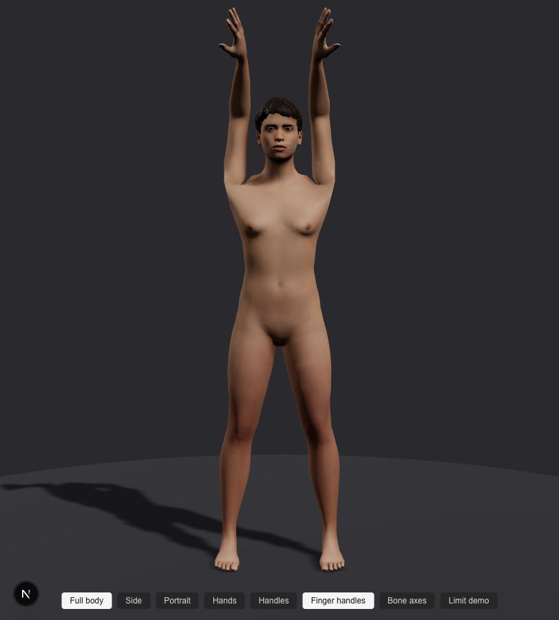 | 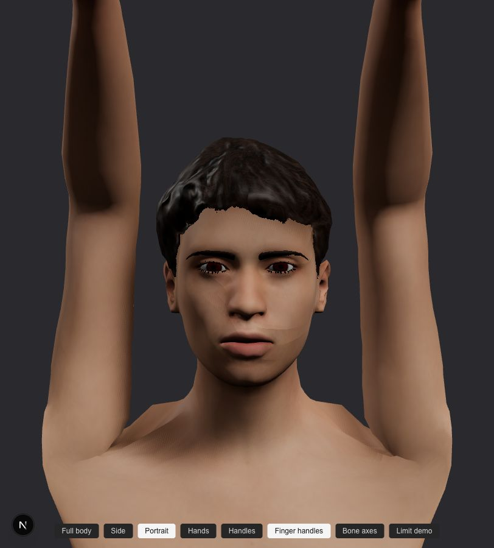 |
| 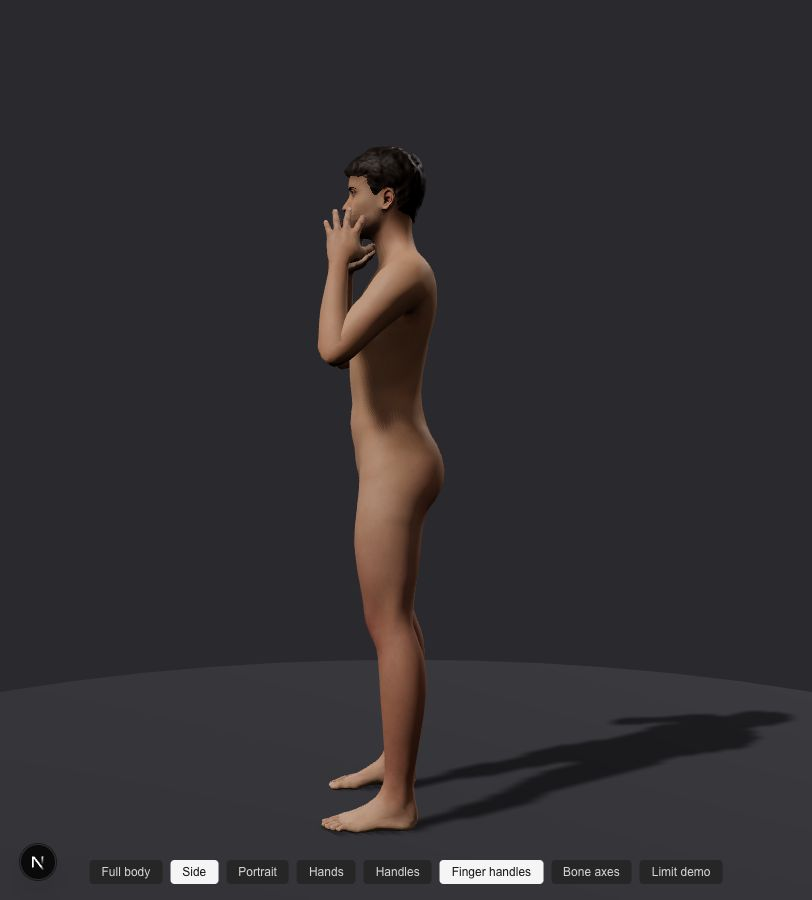 | 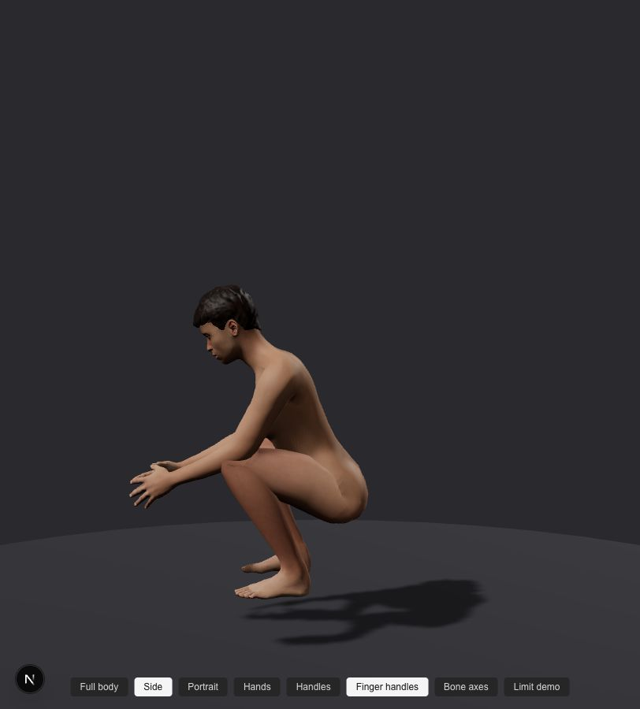 |
| 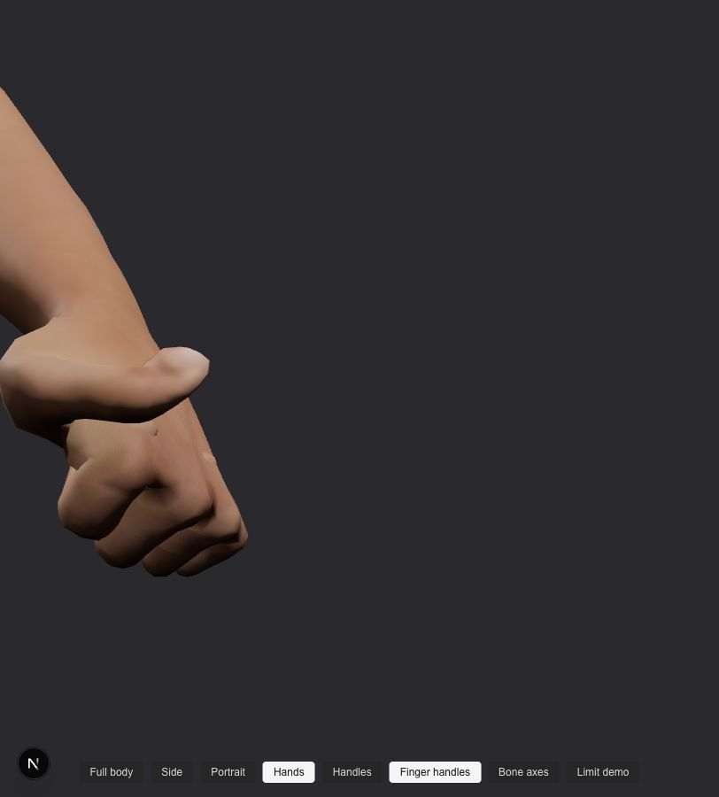 | 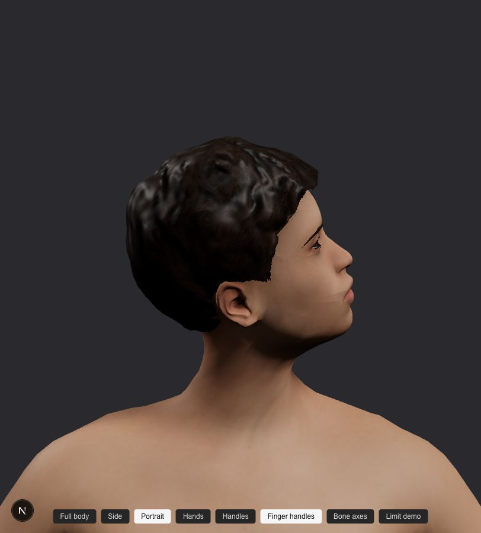 |
| 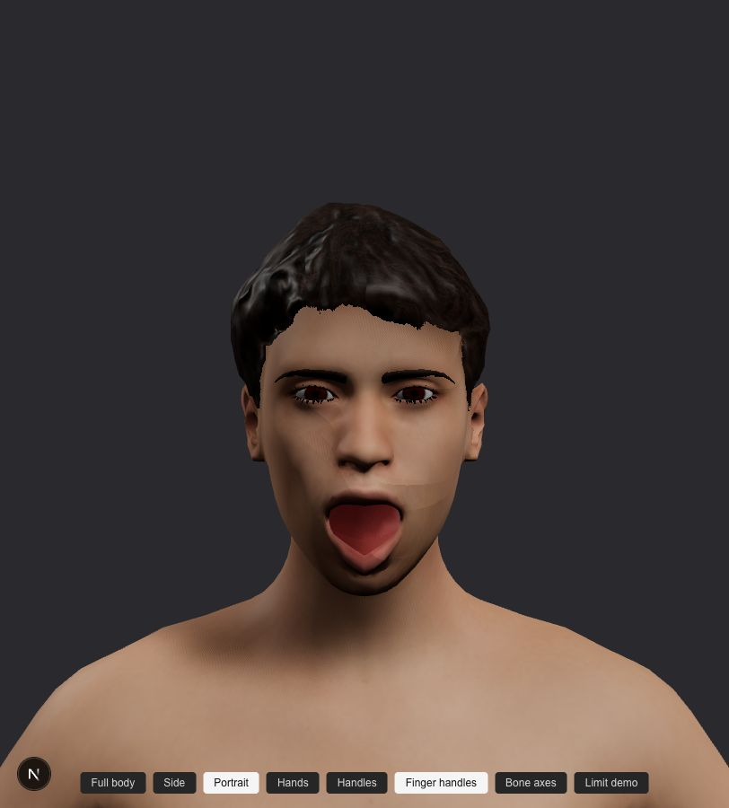 | 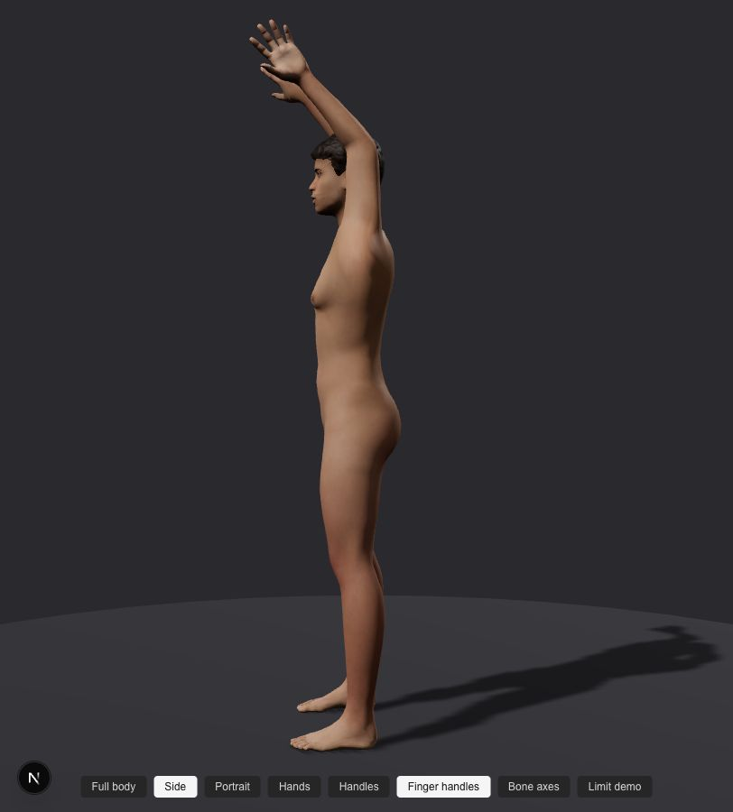 |

## 2a. Dense body (plan 2.8)

Since 2026-10-07 the GLB is the limit-projected Catmull-Clark level 1 of hm08 (107,024 triangles); skin
weights are subdivided with the same stencils. Shares are comparable with the coarse table because each
dense triangle covers a quarter of the area.

| Pose | Collapsed | Inverted | Share | Coarse share |
|---|---|---|---|---|
| Arms up | 106 | 378 | 0.45 % | 0.54 % |
| Elbows 140 | 62 | 222 | 0.27 % | 0.25 % |
| Deep squat | 140 | 426 | 0.53 % | 0.64 % |
| Fists | 507 | 901 | 1.32 % | 1.47 % |
| Head turn | 4 | 60 | 0.06 % | 0.04 % |
| Jaw open | 2 | 77 | 0.07 % | 0.07 % |

Four poses improve; elbows and head turn rise slightly (smoother weights spread the neck twist over more
triangles whose first vertex has a different dominant bone).

## 3. Tried and rejected

**Laplacian weight smoothing** over the body surface in the transition zones (4, 8 and 12 iterations,
lambda 0.5-0.6). No material change: arms up 26 -> 24-34 collapsed, fists 118 -> 119-145. The collapse is
a property of linear blending, not of rough weights. Removed.

**Dual quaternion skinning (DQS)**, CPU metric and a GPU shader. Collapse disappears at the shoulder
(26 -> 0) and drops in fists (118 -> 74), but the image shows a large shoulder bulge and stepped
silhouettes along the trapezius: MakeHuman's weights are painted in steps that linear blending hides
and DQS exposes, and wide shoulder weights over far-apart pivots balloon. Removed.

| DQS | 50 % LBS / DQS blend |
|---|---|
| 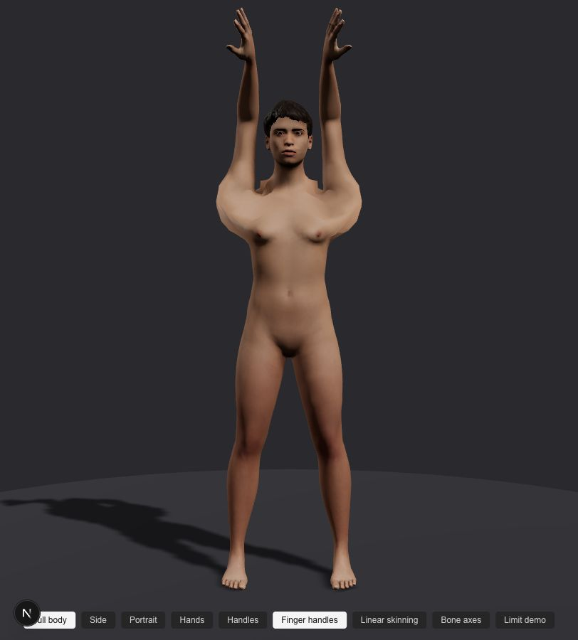 | 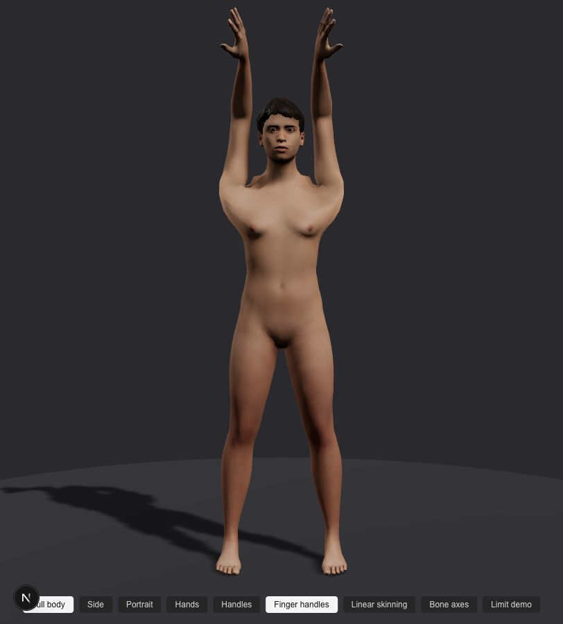 |
| 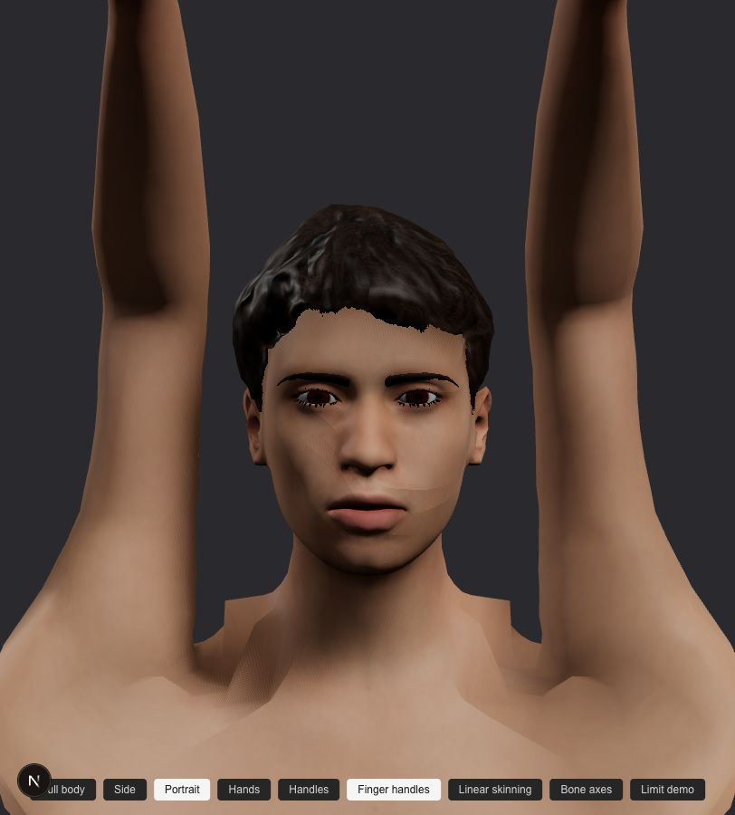 | 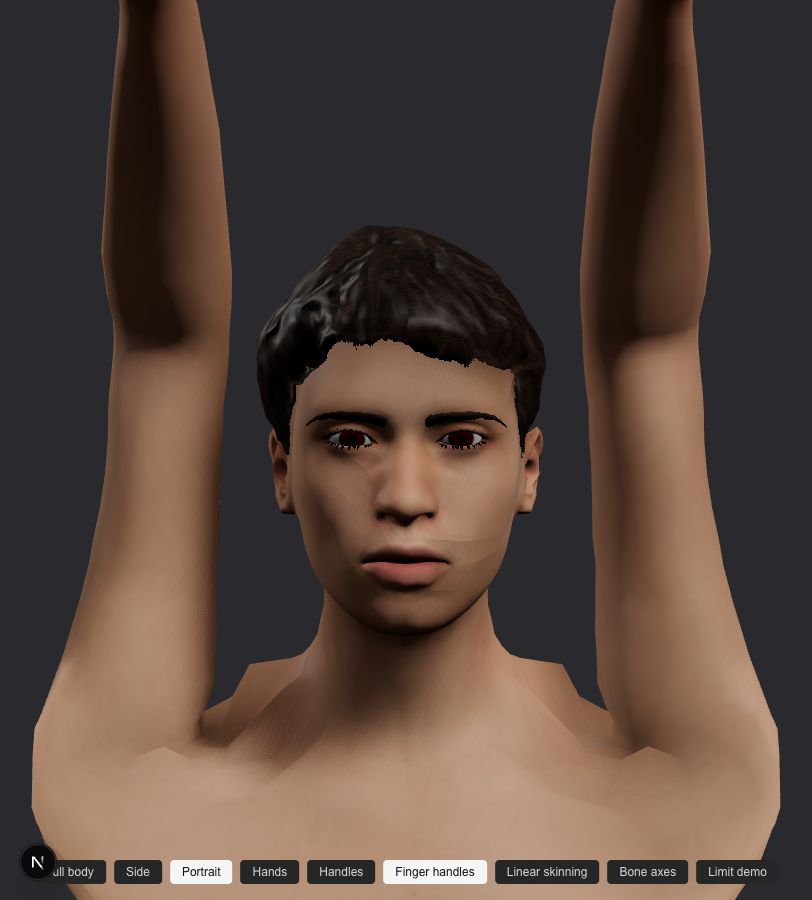 |

**50 % LBS / DQS blend.** Less bulge than DQS, still wider shoulders and the same steps. Removed.

## 4. Decision and follow-ups

- Keep linear blend skinning: it is what the MakeHuman / MPFB rig and weights are made for, and it gives
  the cleanest result on this pose set.
- Remaining issues and how to address them later:
  - Shoulder top flattens above about 110 degrees of abduction: pose-driven corrective shapes for the
    shoulder, or helper bones (deltoid / scapula), once corrective data exists.
  - Groin and buttock crease in deep hip flexion: same corrective approach.
  - Knuckle and inner-elbow creases: natural folds; acceptable for stills.
- The pose set and the regression test stay, so later rig, weight or limit work is measured against
  these numbers.
